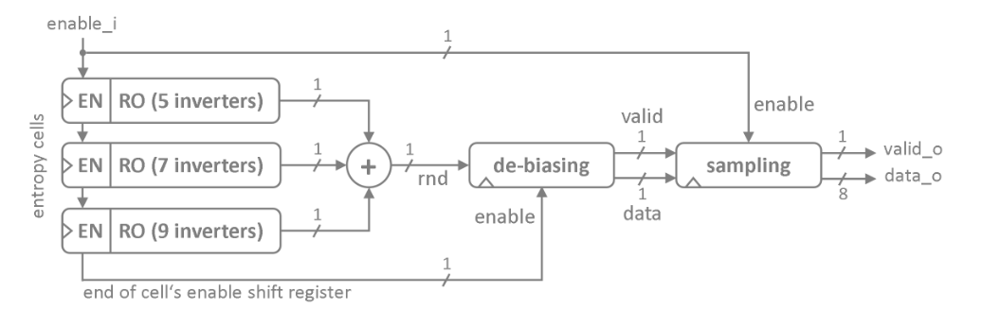

# neoTRNG - True Random Number Generator

neoTRNG is a **platform-independent, lightweight True Random Number Generator (TRNG)** designed for FPGA/ASIC implementations.  
It leverages the inherent **phase noise** of ring oscillators to generate high-quality random numbers without requiring platform-specific primitives or attributes.

---

## 🚀 Features
- **Configurable Entropy Cells (NUM_CELLS):**  
  Each cell is a ring oscillator built from an odd number of inverters.  
- **Entropy Source:**  
  Uses *thermal noise* and *shot noise* causing frequency fluctuations in ring oscillators.  
- **Sampling Mechanism:**  
  The last inverter state is sampled into a flip-flop with a static clock (`clk_i`).  
- **Randomness Mixing:**  
  XOR-combining of entropy cells ensures unpredictability.  
- **Bias Removal & Post-processing:**  
  Randomness extractor + spectral distribution improvements for stronger randomness.  
- **Byte-wide Output:**  
  Bit streams are de-serialized into byte-wide random values.  

---

## 🏗️ Architecture

The following diagram illustrates the high-level architecture of **neoTRNG**:

  
*(Replace `architecture.png` with your actual architecture image file name in the repo)*

---

## ⚙️ How It Works
1. **Entropy Cells:**  
   Each cell (RO) oscillates at a frequency defined by propagation delays, which fluctuate chaotically.  
2. **Sampling:**  
   Flip-flops sample the noisy output of ROs at the static clock.  
3. **Mixing & De-biasing:**  
   XOR gates combine outputs, followed by a randomness extractor.  
4. **Post-processing:**  
   Ensures statistical soundness and generates byte-wide random numbers.  

---

## 📂 Repository Structure
